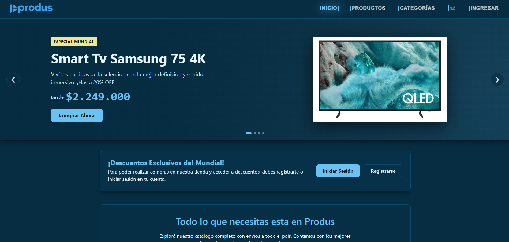
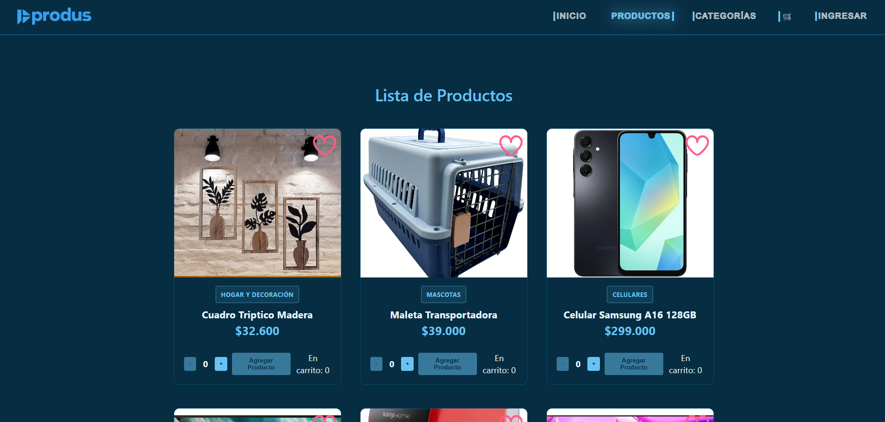
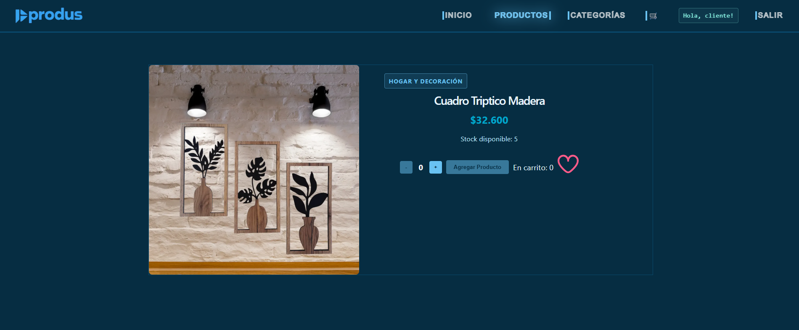
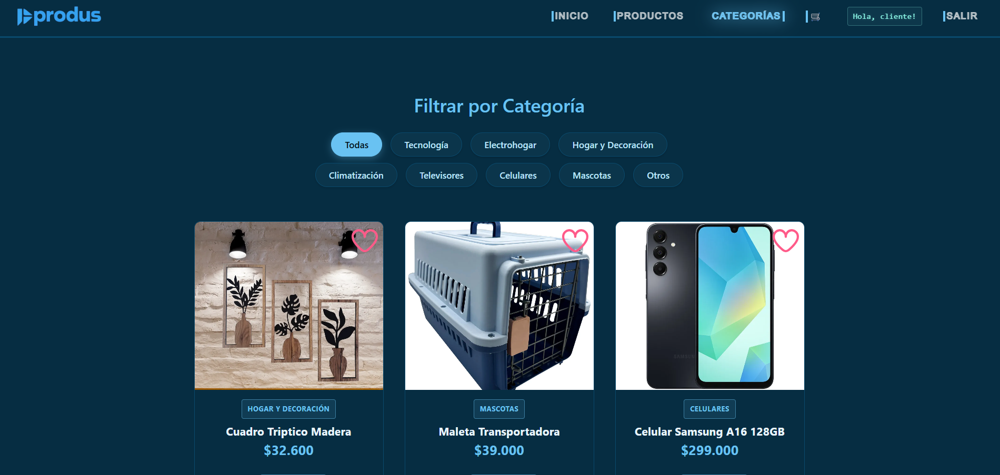
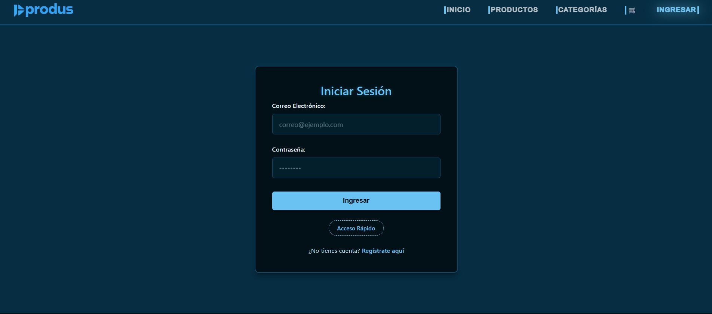
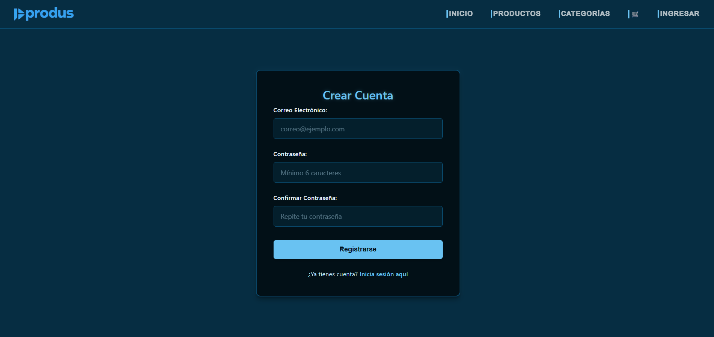
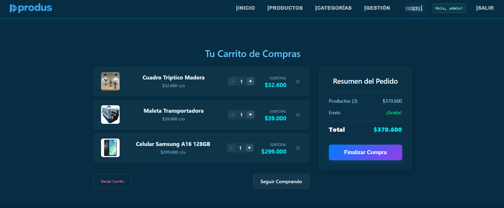
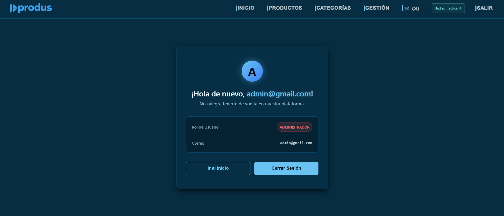
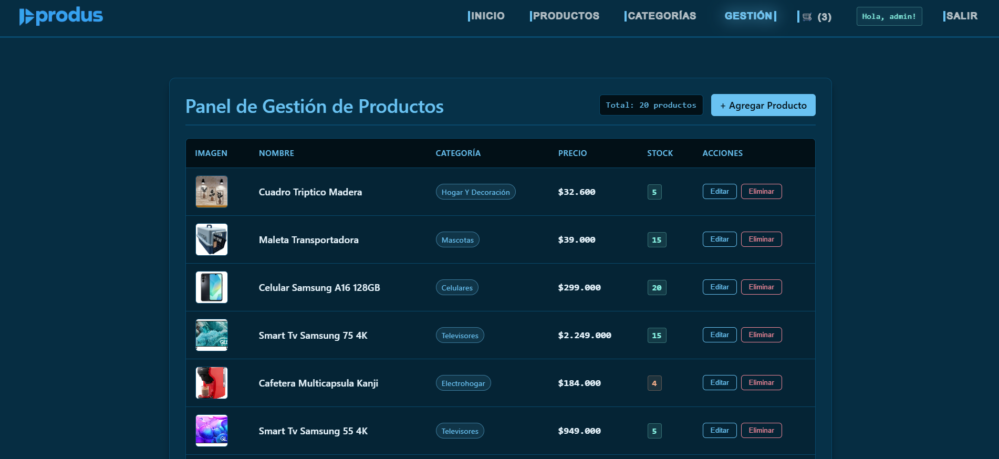
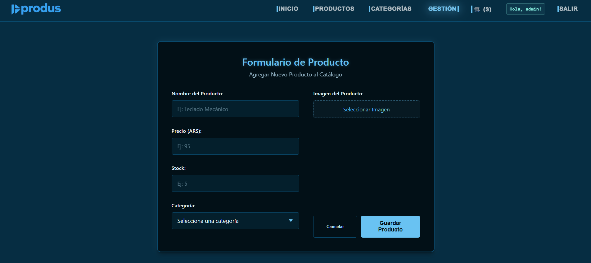

# <p align="center"></p>

## 📝 Descripción del Proyecto

**PRODUS** es una aplicación web de comercio electrónico moderna, rápida y dinámica, diseñada para ofrecer a los usuarios un catálogo de productos en categorías como Tecnología, Electrohogar, Climatización, Celulares y más. 

El proyecto cuenta con integraciones en tiempo real para la base de datos y autenticación, así como un panel completo de administración para gestionar el inventario de stock, añadir nuevos artículos y subir imágenes de forma dinámica.

---


## 🗺️ Vistas del Proyecto

La aplicación cuenta con las siguientes vistas principales, organizadas mediante un sistema de rutas y accesibilidad según el rol del usuario:

### 🔓 Públicas
1.  **Inicio / Home (`/`)**: Portada principal con un carrusel dinámico interactivo (filtrando artículos de la categoría "Especial Mundial" de televisores) y banners promocionales.

2.  **Catálogo (`/productos`)**: Listado completo de los productos nacionales con estados de carga.

3.  **Ficha de Producto (`/producto/:id`)**: Detalle extendido de un producto específico, permitiendo ver especificaciones y añadirlo al carrito.

4.  **Categorías (`/categorias`)**: Vista para navegar de forma directa y segmentada por las distintas categorías disponibles.

5.  **Ingresar (`/login`)**: Formulario de inicio de sesión con validaciones (protegida para usuarios no autenticados).

6.  **Registro (`/registro`)**: Formulario para la creación de nuevas cuentas (protegida para usuarios no autenticados).


### 🔒 Protegidas (Requieren Login)
7.  **Carrito de Compras (`/carrito`)**: Lista de artículos agregados por el usuario, permitiendo modificar las cantidades y calcular totales antes de finalizar la compra.

8.  **Mi Perfil (`/perfil`)**: Panel del usuario donde se muestra información del correo y estado de la cuenta.


### 🛡️ Administrativas (Solo rol `admin`)
9.  **Panel de Gestión (`/gestion`)**: Tablero de control ABM (Alta, Baja, Modificación) para gestionar productos en tiempo real, editar detalles, eliminar y actualizar stocks de la base de datos Firestore.

10. **Agregar Producto (`/agregar-producto`)**: Formulario avanzado para la creación de artículos con validación de datos y subida directa de imágenes de portada utilizando la API de **ImgBB**.


---

## 📂 Estructura del Proyecto

A continuación se detalla la estructura principal del código fuente (`/src`):

```text
src/
├── assets/          # Imágenes locales, iconos y logotipos (produsbarra.jpg, hero.png, etc.)
├── components/      # Componentes organizados por módulos
│   ├── ProtectedRoute/ # Validador de rutas por rol y autenticación
│   ├── carrito/     # Vistas y lógica del carrito de compras
│   ├── contactos/   # Visualización de miembros del equipo
│   ├── form/        # Formularios dinámicos
│   ├── gestion/     # Panel administrativo de inventario
│   ├── inicio/      # Sección de portada y carrusel
│   ├── layout/      # Estructura general de la app (Header, Navbar, Footer)
│   ├── login/       # Formulario de inicio de sesión
│   ├── products/    # Catálogo, tarjetas y detalles de productos
│   ├── registro/    # Formulario de creación de cuenta
│   └── ui/          # Componentes genéricos de interfaz (Botones, Spinners)
├── context/         # Proveedores de estado global (Auth, Cart, Productos, Toast)
├── data/            # Archivos estáticos de configuración (categorias.json)
├── firebase/        # Configuración inicial e inicialización del SDK de Firebase
├── hooks/           # Hooks personalizados de React (useCart, useProductos, useEquipo, etc.)
├── App.jsx          # Componente principal y definición de rutas
└── main.jsx         # Punto de entrada de la aplicación
```

---

## ⚙️ Configuración e Instalación

Sigue estos pasos para levantar el proyecto en tu entorno local:

### 1. Clonar el repositorio
```bash
git clone <url-del-repositorio>
cd PRODUS
```

### 2. Configurar las Variables de Entorno
Crea un archivo `.env` en la raíz del proyecto basándote en la siguiente estructura:
```env
VITE_API_KEY=tu_api_key_aqui
VITE_MOCKAPI=url_de_mockapi_opcional
VITE_IMGBB_API_KEY=tu_clave_api_de_imgbb_para_imagenes
```
*Nota: La API Key de ImgBB es estrictamente necesaria para poder subir imágenes desde el panel de agregar/editar productos.*

### 3. Instalar Dependencias
```bash
npm install
```

### 4. Ejecutar en Modo Desarrollo
```bash
npm run dev
```
La aplicación estará disponible por defecto en `http://localhost:5173`.

### 5. Compilar para Producción
```bash
npm run build
```

---

## 🚀 Tecnologías Utilizadas

El proyecto está construido sobre:

*   **Core / View Library**: [React 19](https://react.dev/)
*   **Herramienta de Construcción (Build Tool)**: [Vite 8](https://vite.dev/) (con Hot Module Replacement rápido)
*   **Enrutamiento**: [React Router DOM 7](https://reactrouter.com/) (manejo dinámico de rutas protegidas y públicas)
*   **Estilos y Componentes**: 
    *   [Styled Components 6](https://styled-components.com/) (estilos dinámicos basados en props)
    *   CSS Vanilla y CSS Modules para estilos encapsulados
*   **Backend como Servicio (BaaS)**: [Firebase 12](https://firebase.google.com/)
    *   **Firestore Database**: Almacenamiento en tiempo real con `onSnapshot` (colecciones `productos-nacionales` y `equipo`).
    *   **Firebase Authentication**: Autenticación segura de usuarios y gestión de roles (`admin` / `user`).
*   **Integración de Terceros**:
    *   **ImgBB API**: Para la subida de imágenes de productos y almacenamiento en la nube directamente desde el formulario de administración.

---